# Windows Server 2025 Active Directory Homelab

## Project Overview

This project involved building a virtualized Windows Server environment to simulate a small enterprise network. The lab demonstrates core system administration tasks including deploying a domain controller, configuring DNS services, managing domain users, applying Group Policy, and joining a Windows 11 client workstation to the domain.

## Objectives

- Deploy a Windows Server 2025 virtual machine
- Install and configure Active Directory Domain Services (AD DS)
- Configure DNS for domain name resolution
- Create and manage domain users and Organizational Units (OUs)
- Implement Group Policy controls
- Join a Windows 11 workstation to the domain
- Verify domain authentication and network connectivity

## Lab Environment

### Host System
- Windows 10
- Intel Core Processor
- 16 GB RAM
- 500 GB SSD

### Virtualization
- VMware Workstation

### Domain Controller
- Windows Server 2025
- 1 vCPU
- 4 GB RAM
- 40 GB Storage

### Client Workstation
- Windows 11
- 2 vCPU
- 4 GB RAM
- 70 GB Storage

## Technologies Used

- Windows Server 2025
- Active Directory Domain Services (AD DS)
- DNS Server
- Group Policy Management
- VMware Workstation
- Windows 11
- Windows Networking Tools

## Implementation

### 1. Virtualization Environment

A virtualization platform (VMware)  was installed on the host machine to allow multiple operating systems to run simultaneously within a controlled lab environment.

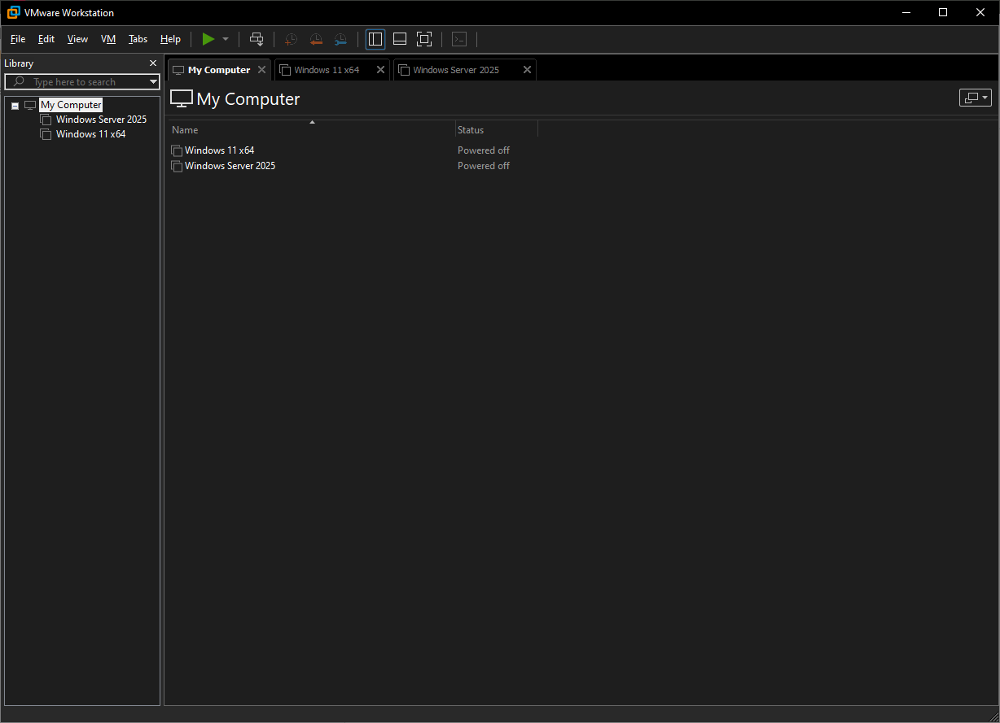

Figure 1 - Virtualization platform interface displaying the configured virtual machines used to simulate the lab environment. The host system runs multiple virtual machines including a Windows 2025 Server domain controller and a Windows 11 client workstation.

### 2. Windows Server Virtual Machine

A virtual machine was created to host the Windows 2025 Server operating system. System resources including CPU, RAM, and storage were allocated to support server functionality.	

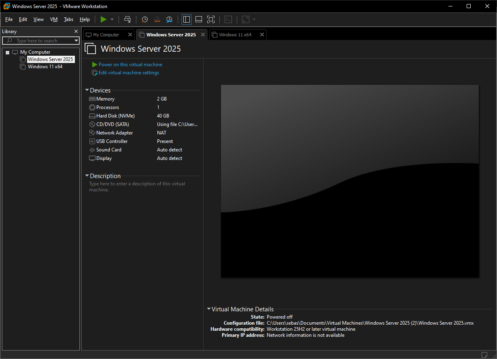

Figure 2 - Virtual machine configuration showing allocated system resources including CPU cores, memory, and virtual storage for the Windows Server environment.

### 3. Initial Server Configuration

Initial system configuration tasks were performed including renaming the server, configuring Windows updates, and enabling remote management. 	

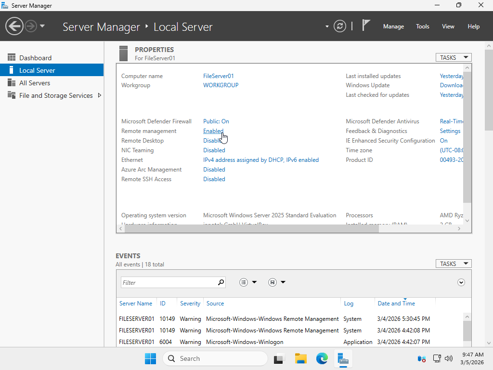

Figure 3 – Local Server configuration panel in Server Manager displaying system settings including computer name, Windows Update status, and remote management configuration following the initial server setup.

### 4. Static IP Configuration

The server was assigned a static IP address to ensure reliable communication within the network environment.

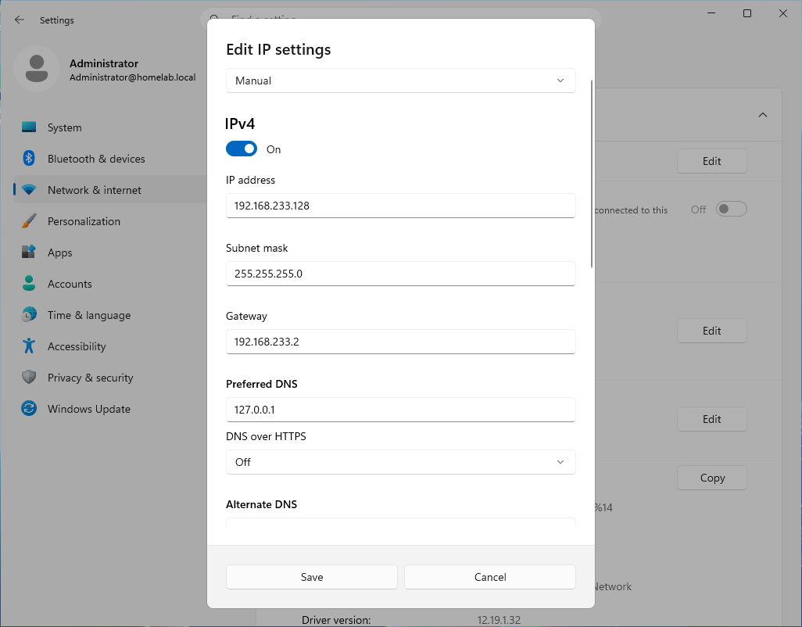

Figure 4 - Network adapter IPv4 configuration showing the manually assigned static IP address used to ensure consistent communication between the server and client systems within the lab network.

### 5. Active Directory Domain Services

Installed the Active Directory Domain Services (AD DS) role through Server Manager to provide centralized authentication and directory management.

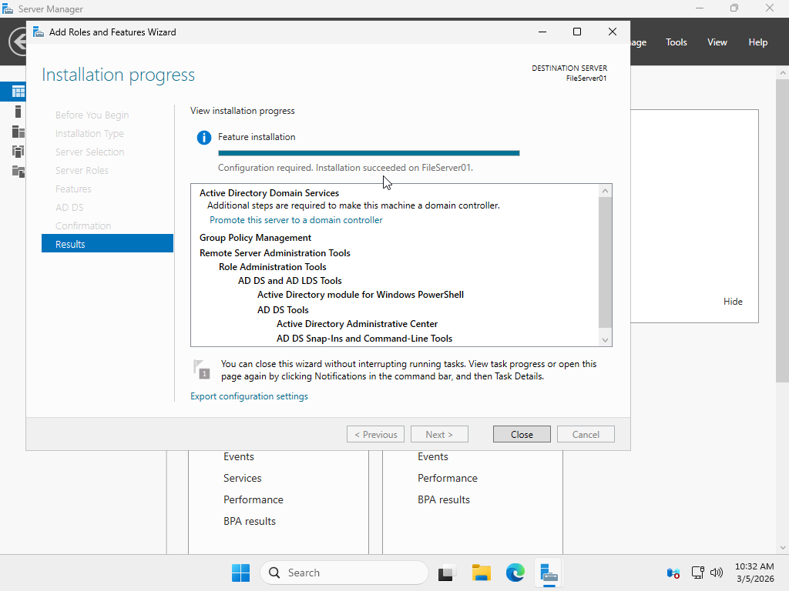

Figure 5 - Server Manager showing AD DS role installed.

### 6. Domain Controller Configuration

The server was promoted to a Domain Controller and a new domain was created. DNS services were installed automatically during this process.

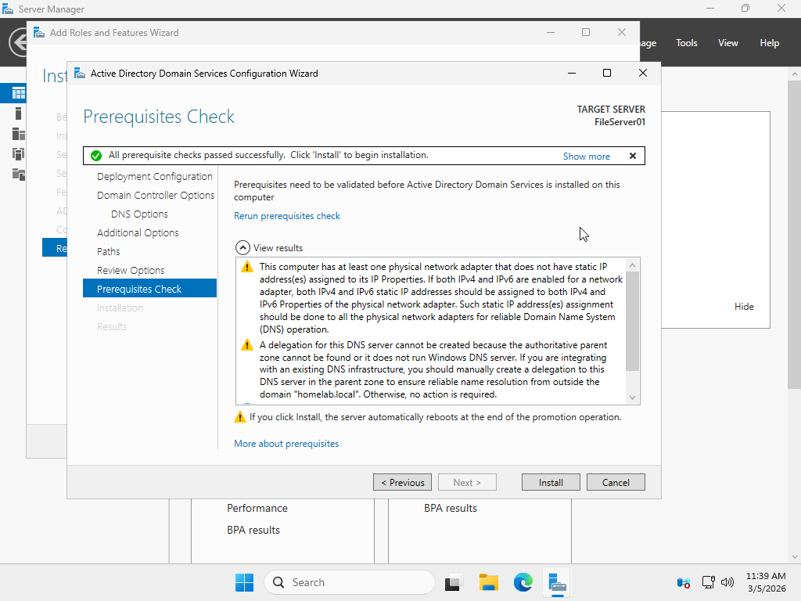

Figure 6 - Domain controller configuration wizard used to promote the server to a domain controller and create the new domain environment.

### 7. DNS Configuration

DNS Manager was used to verify the domain’s Forward Lookup Zone and confirm that domain records were successfully created.

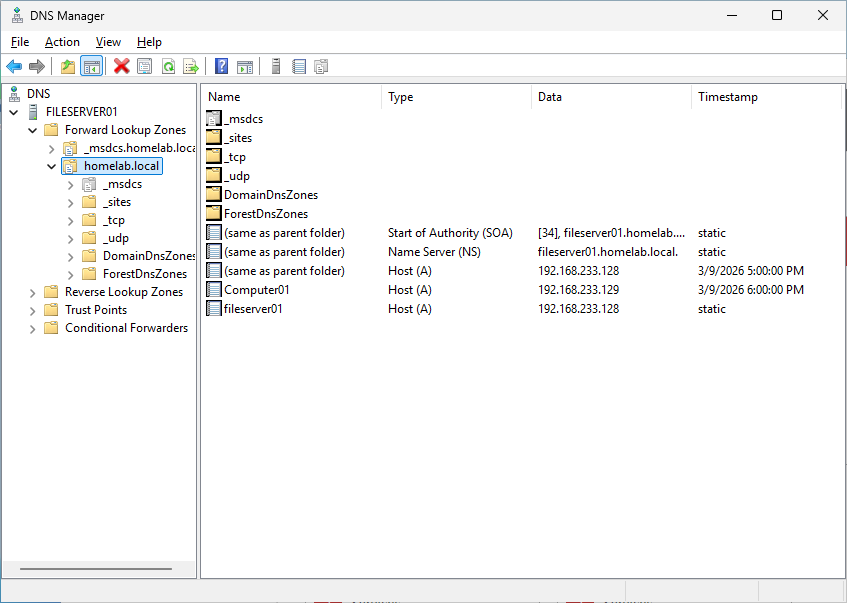

Figure 7 -  DNS management console showing the configured Forward Lookup Zone for the domain.

### 8. Users and Organizational Units

User accounts and organizational units were created in Active Directory Users and Computers to simulate a structured business environment.

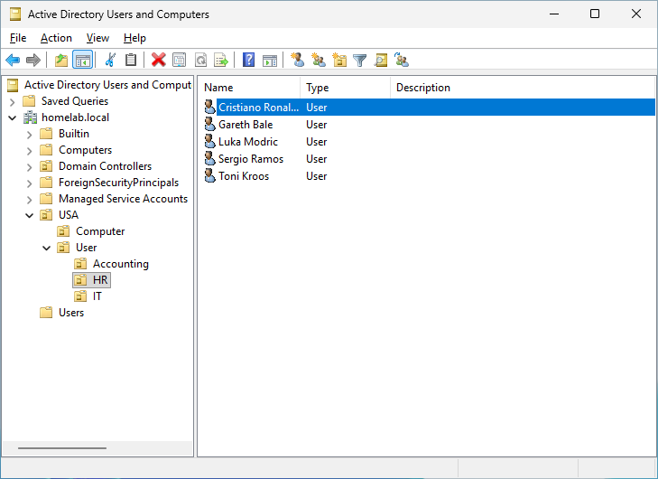

Figure 8 - Active Directory Users and Computers console displaying created domain users and organizational units within the domain.

### 9. Group Policy

A Group Policy was implemented to restrict user access to the Control Panel, demonstrating administrative control over domain workstations.

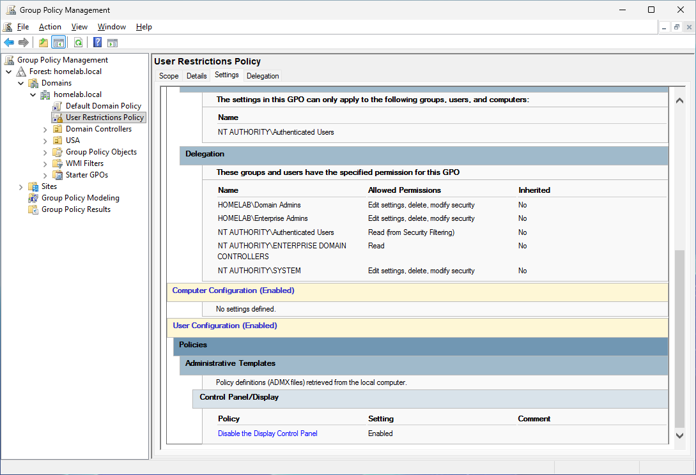

Figure 9 - Group Policy Management Console displaying a policy restricting user access to the Control Panel.

### 10. Windows 11 Client

A client virtual machine running Windows 11 was created to simulate a workstation connected to the network.

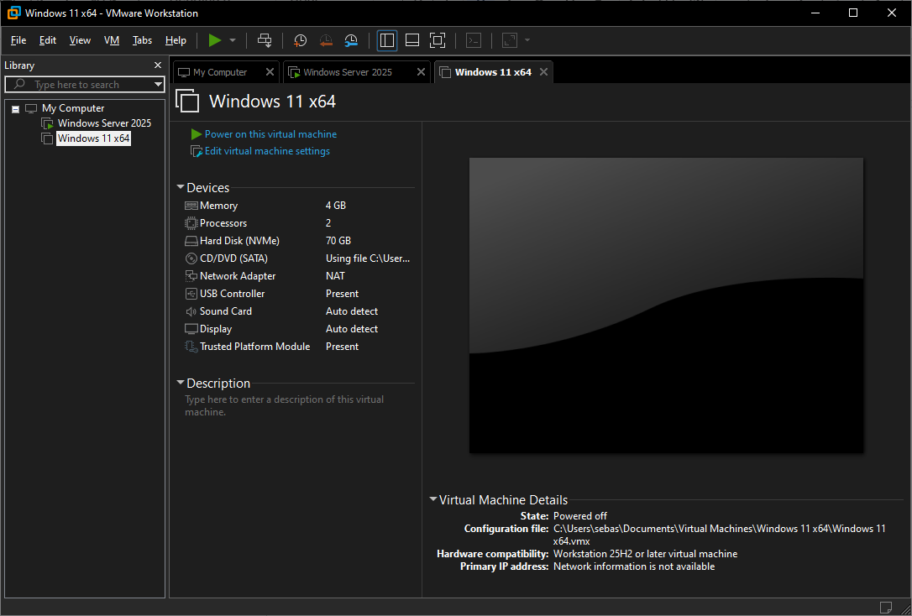

Figure 10 - Windows 11 client virtual machine used to simulate a workstation within the domain environment.

### 11. Domain Join

The client workstation was joined to the domain and restarted to apply domain configuration.

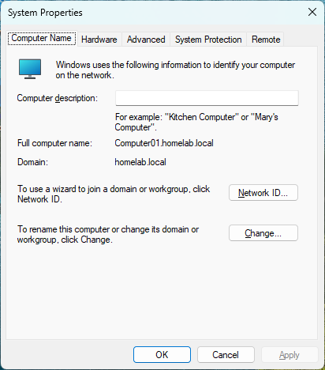

Figure 11 -  System Properties displaying the client workstation successfully joined to the domain, allowing domain authentication and centralized management through the domain controller.

### 12. Testing and Verification

A domain user account was used to log into the client workstation. Network connectivity and DNS resolution were verified using command-line tools.

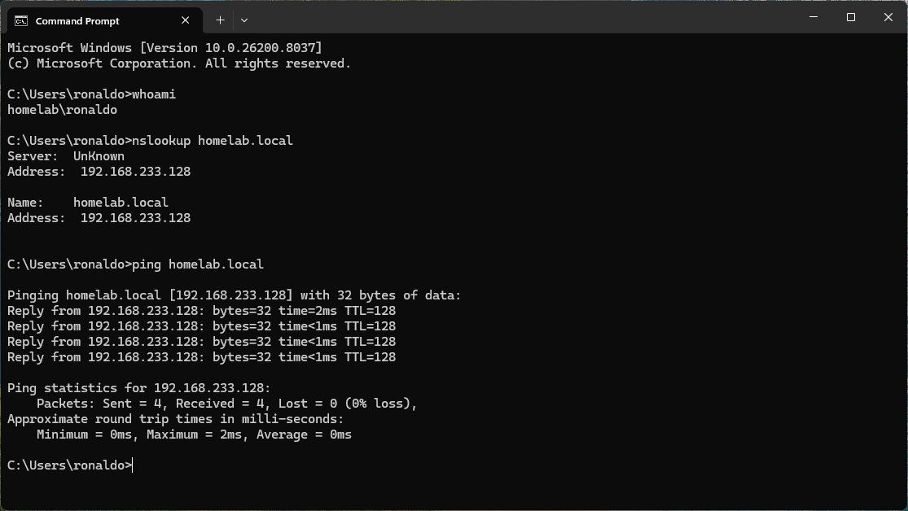

Figure 12 - Command Prompt showing successful DNS resolution and connectivity tests.

## Results

Successfully deployed a functional Windows domain environment. The Domain Controller provided centralized authentication, DNS name resolution, and Group Policy management. The Windows 11 workstation successfully joined the domain and authenticated using domain credentials.

## Skills Demonstrated

- Windows Server Administration
- Active Directory Management
- DNS Configuration
- Group Policy Management
- User and OU Administration
- Virtual Machine Deployment
- Windows Networking
- Network Troubleshooting
- Domain Authentication
